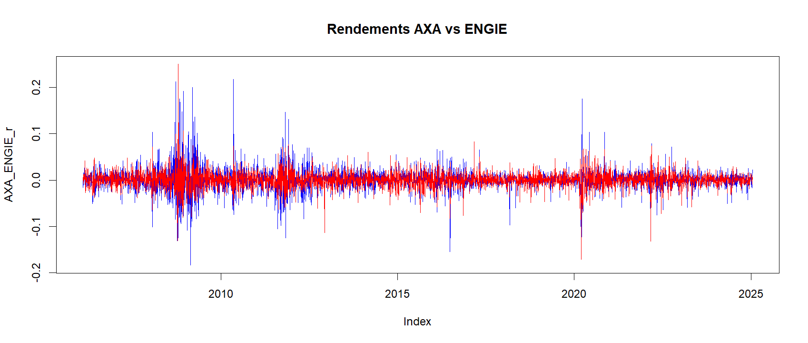
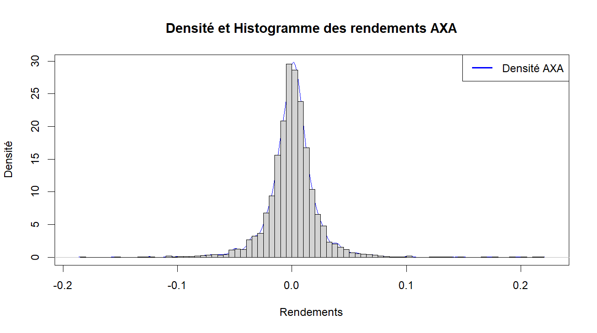
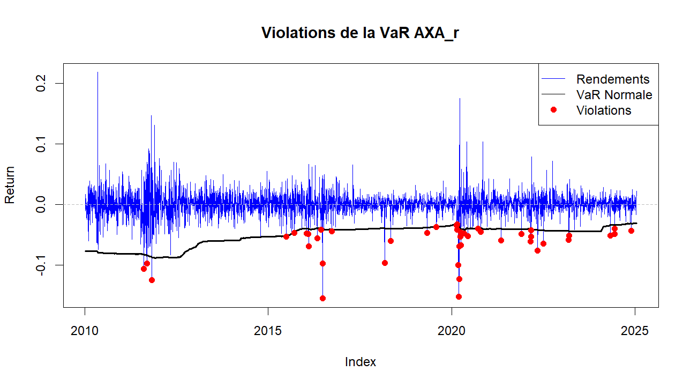
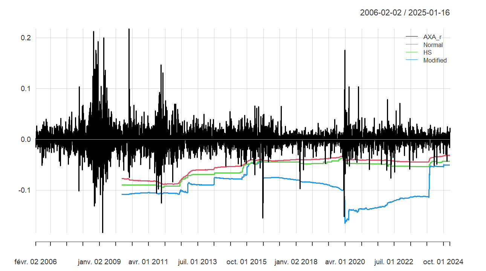

# 📊 **Financial Risk Analysis of AXA and ENGIE Stocks Using R**

This project analyzes the **financial risk** of two major stocks—**AXA** and **ENGIE**—by applying various statistical and econometric models. Using **Value at Risk (VaR)**, **Expected Shortfall (ES)**, and **portfolio risk analysis**, we explore how extreme risks are quantified and backtested over time. The analysis also examines portfolio risk diversification and contributions to overall risk.

---

## **1. Project Overview**

### **1.1 Problem Statement**
- Financial markets are subject to extreme fluctuations, as seen during events like the **2008 financial crisis** and **2020 pandemic**.
- Institutions need robust risk management strategies, including tools like **VaR** and **ES**, to mitigate potential losses during such events.

### **1.2 Objectives**
- Calculate and compare **VaR** and **ES** using different methods (Historical, Gaussian, Cornish-Fisher).
- Perform **backtesting** to evaluate the accuracy of these risk measures.
- Analyze portfolio performance and the contribution of individual assets to total risk.

---

## **2. Methodology**

- **Data**: Daily stock prices for AXA and ENGIE, merged into a single dataset indexed by date.
- **Models Applied**:
    - **Descriptive statistics** to understand return distributions.
    - **VaR and ES** calculations using multiple approaches.
    - **Portfolio risk analysis** to evaluate asset contributions to risk.
    - **Backtesting** to validate the accuracy of risk estimates.

---

## **3. Code Highlights**

### **3.1 Calculating Returns**
The function below calculates discrete returns for both AXA and ENGIE stocks:

```r
# Calculate discrete returns
AXA_r <- CalculateReturns(AXA, method = "discrete")[-1, ]
ENGIE_r <- CalculateReturns(ENGIE, method = "discrete")[-1, ]
```



### **3.2 Visualizing Returns**
Plot the returns of AXA and ENGIE over time to observe fluctuations.

```r
plot.zoo(merge(AXA_r, ENGIE_r), main = "Rendements AXA vs ENGIE", plot.type = "single", col = c("blue", "red"))
legend("bottomleft", legend = c("AXA", "ENGIE"), col = c("blue", "red"), lwd = 2)
```
! [I3](./Image/Image3.png)


---

### **3.3 Descriptive Statistics**
Check the basic descriptive statistics for both stocks:

```r
# Descriptive statistics for AXA and ENGIE
basicStats(AXA_r)
basicStats(ENGIE_r)
```

Key findings:
- **AXA**: Skewness = 0.64, Kurtosis = 13.26
- **ENGIE**: Skewness = 0.23, Kurtosis = 15.21

---

### **3.4 VaR and ES Calculations**
We calculate VaR and ES using **historical**, **Gaussian**, and **Cornish-Fisher** methods.

```r
# VaR and ES for AXA at 99% confidence level
VaR_historical_axa <- VaR(AXA_r, p = 0.99, method = "historical")
ES_historical_axa <- ES(AXA_r, p = 0.99, method = "historical")
```

Results for AXA (position = 1,000,000 EUR):
| Method       | VaR (EUR)   | ES (EUR)     |
|--------------|-------------|---------------|
| Historical   | -66,295.39  | -90,928.91    |
| Gaussian     | -52,944.15  | -60,702.07    |
| Modified     | -109,507.08 | -109,507.08   |

Results for ENGIE (position = 1,000,000 EUR):
| Method      | VaR (99%)      | ES (99%)       |
|-------------|----------------|----------------|
| Historical  | -48,639.58     | -68,486.19     |
| Gaussian    | -40,776.76     | -46,725.64     |
| Modified    | -99,970.03     | -99,970.03     |
---


### **Graphical Analysis**

#### **1. Violations of VaR for AXA Returns**

- This chart displays the **violations** of Value at Risk (VaR) for AXA returns over time.
- The blue line represents daily returns, the black line shows the **normal VaR** threshold, and red dots indicate violations where returns exceeded the risk threshold.
- Notable spikes in violations coincide with major financial events, such as the **2008 financial crisis** and **2020 pandemic crash**.

---

#### **2. Comparative VaR Models**

- This visualization compares VaR estimates under three methods (**Normal**, **Historical Simulation (HS)**, and **Modified Cornish-Fisher**) for AXA.
- The **black** line shows actual AXA returns, while **colored** lines represent different VaR thresholds.
- The **Modified VaR** line captures more extreme events, illustrating its robustness in accounting for tail risk.


### **3.5 Backtesting**
We implement **rolling backtesting** to validate the accuracy of VaR models.

```r
# Backtesting VaR for AXA
var.results <- rollapply(
  data = as.zoo(AXA_r), 
  width = FE,
  FUN = backTestVar, 
  p = alpha, 
  by.column = FALSE, 
  align = "right"
)

# Plot violations
plot(as.zoo(AXA_r[index(var.results), ]), col = "blue", ylab = "Return", main = "Violations de la VaR AXA")
points(as.zoo(AXA_r[violation.dates, ]), col = "red", pch = 16, lwd = 2)
```

---

### **3.6 Portfolio Analysis**
The portfolio comprises **60% AXA** and **40% ENGIE**. We calculate the **mean return**, **risk**, and **risk contributions** for each stock.

```r
# Portfolio mean return and risk
portfolio_mean_return <- Return.portfolio(returns, weights = c(0.6, 0.4), geometric = FALSE)
portfolio_std_dev <- sqrt(t(weights) %*% cov(returns) %*% weights)

# Contribution to portfolio risk
beta_AXA <- weights[1] * cov_matrix[1, ] %*% weights / portfolio_std_dev
beta_ENGIE <- weights[2] * cov_matrix[2, ] %*% weights / portfolio_std_dev
```

---

### **3.7 Portfolio VaR and ES**
Finally, we compute portfolio-level VaR and ES using the **Cornish-Fisher** method.

```r
VaR_CF <- VaR(portfolio_mean_return, p = 0.95, method = "modified")
ES_CF <- ES(portfolio_mean_return, p = 0.95, method = "modified")
```

---

## **4. Key Findings**

- **AXA** shows higher risk with a maximum return of **21.8%** and a minimum of **-18.4%**.
- **ENGIE** has lower risk with a maximum return of **25%** and a minimum of **-17.2%**.
- **Backtesting** confirms that the **Cornish-Fisher** method captures extreme risks more effectively.
- Portfolio risk is diversified, with contributions proportional to each stock's volatility and covariance.

---

## **5. Project Structure**

- **Code**: R scripts for calculating VaR, ES, and portfolio risk.
- **Data**: Time series data for AXA and ENGIE stocks.
- **Visuals**: Plots generated to visualize returns, VaR violations, and portfolio performance.

---

## **6. Conclusion**

This analysis demonstrates the importance of using advanced risk measures like **Cornish-Fisher VaR** to capture tail risks. Institutions can leverage these insights to enhance risk management strategies in compliance with **Basel III** regulations.

---

### **7. Resources**

- 📈 **Source Code and Data**: Download the code and data files [here](code.R).
